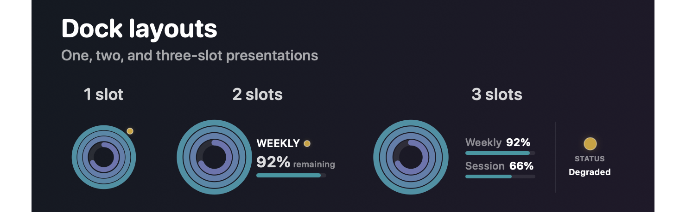
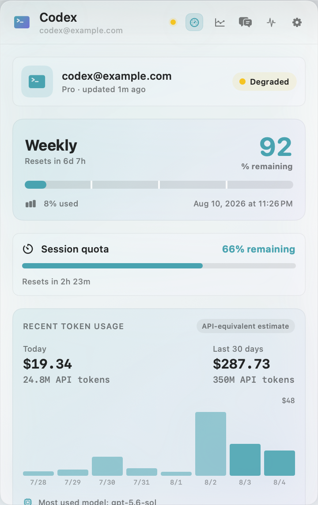
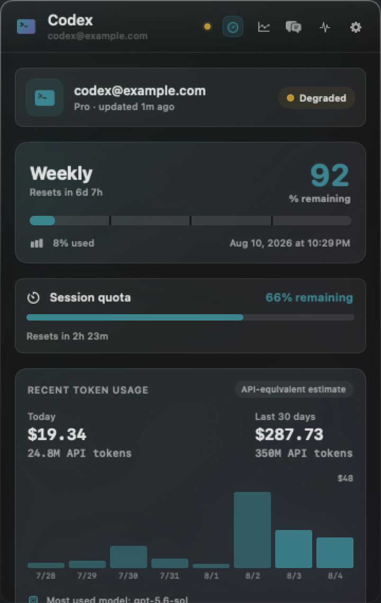
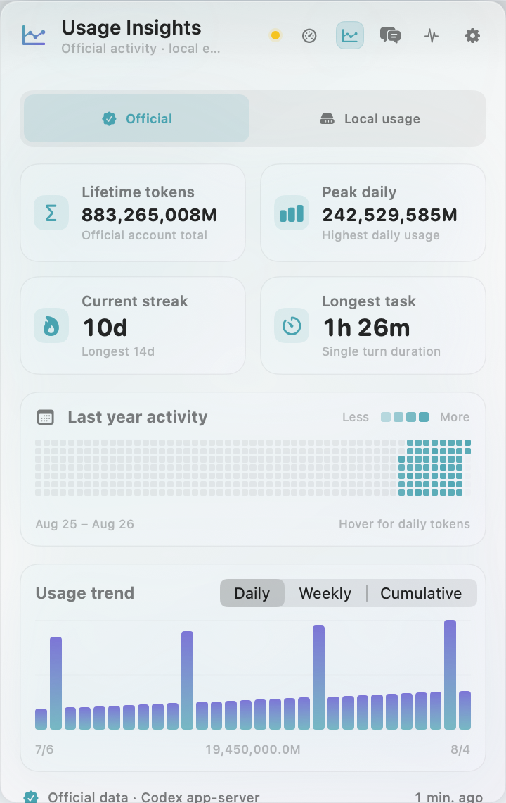
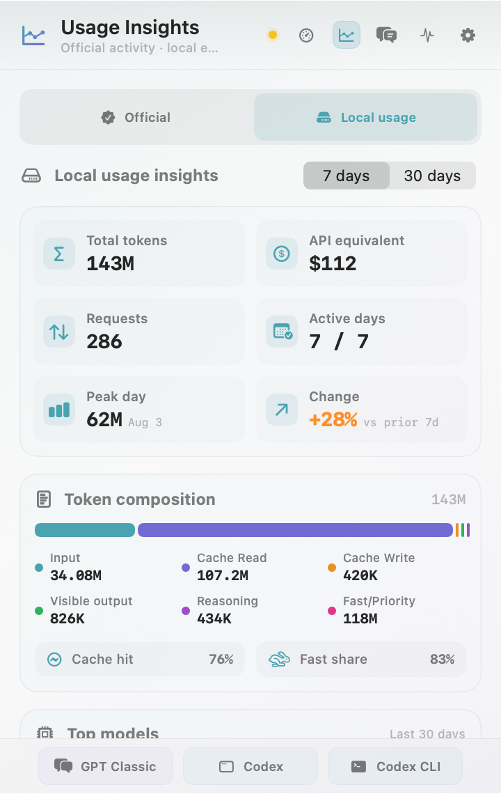
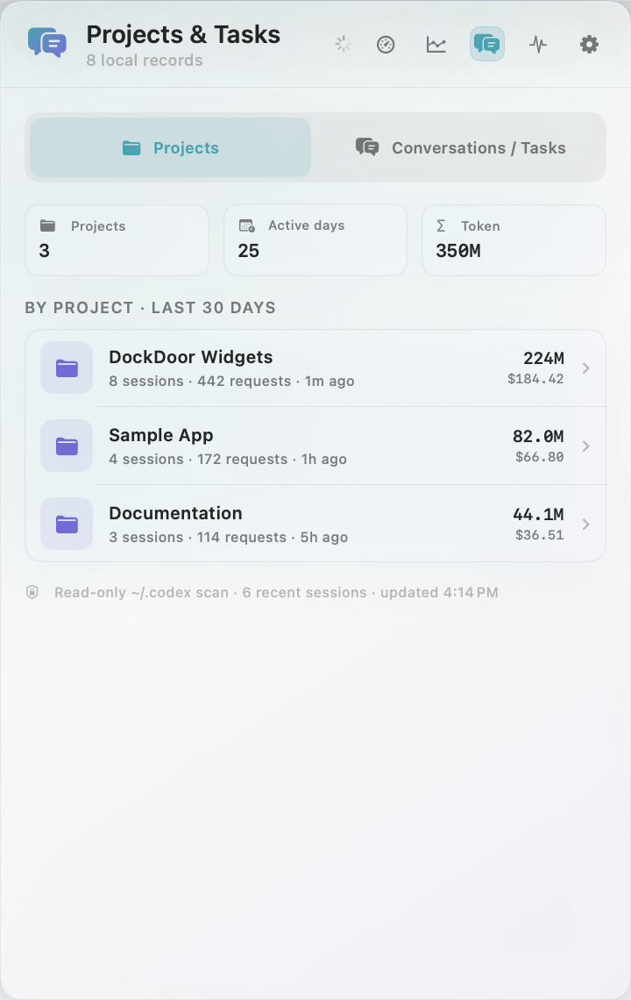
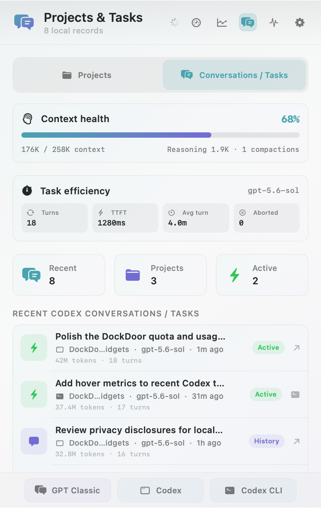
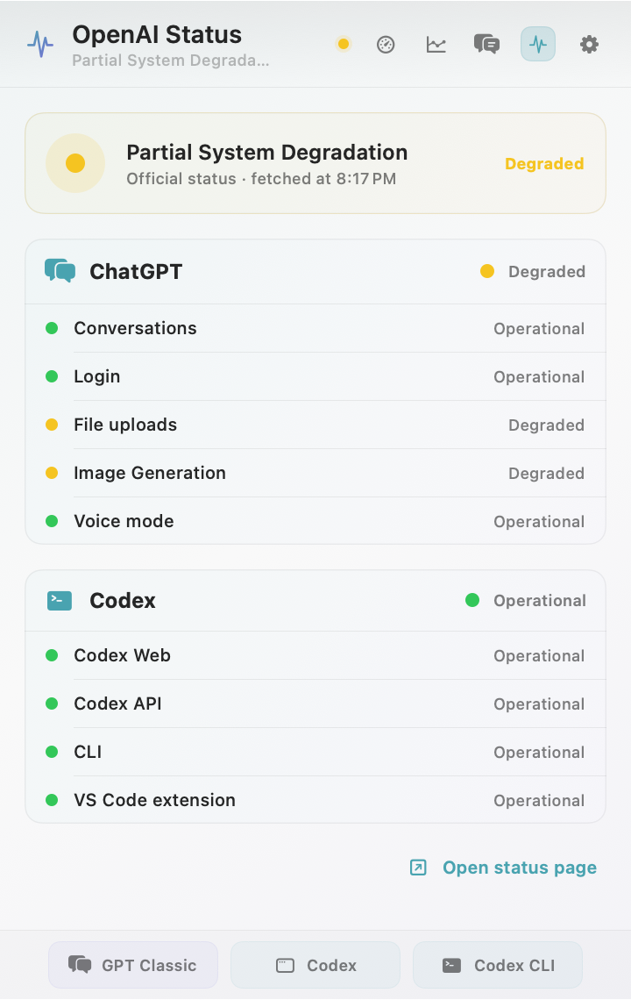
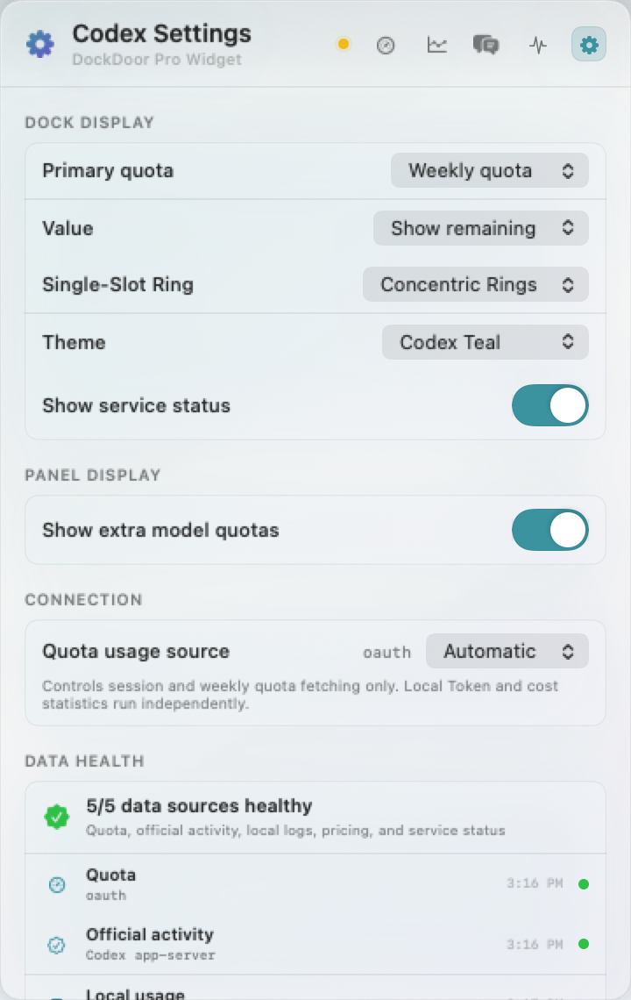

# Codex Usage for DockDoor Pro

An unofficial, feature-rich Codex usage widget for
[DockDoor Pro](https://dockdoor.net/). It brings quota, activity, local Token
analytics, projects/tasks, context health, and OpenAI service status into the
Dock and a native SwiftUI panel.

> This widget is distributed independently and is not part of the DockDoor Pro
> marketplace. Installation is manual.

## What's new in 1.1.1

- Two- and three-slot Dock layouts now provide clearer separation between the
  quota ring and the adjacent percentage, reset, and service-status metrics.

## 1.1.0 highlights

- Choose **Simplified**, **Full**, or **Custom** Panel content. Individual
  pages and cards can be hidden, and cards can be reordered within each page.
- Format Token values automatically, exactly, in millions, or in billions.
- Add an optional bottom quick-launch bar for **GPT Classic**, **Codex
  Desktop**, and **Codex CLI**, with per-button visibility and a selectable
  terminal.
- Codex CLI conversations are identified from local session metadata and can
  be resumed in the selected terminal; Desktop conversations continue to open
  in Codex Desktop.
- Smoother conversation-hover metrics, more readable two-/three-slot Dock
  layouts, and consistent native glass cards across the Panel.

<p align="center">
  
</p>

## Highlights

- One-, two-, and three-slot Dock layouts, including classic, concentric,
  segmented, and automatically rotating single-slot rings.
- Session and weekly quota with used/remaining modes, reset time, pace hints,
  reset credits, and optional extra-model quota cards.
- Recent Token usage and API-equivalent cost estimates with interactive charts.
- Official Codex activity: lifetime usage, peak day, streaks, activity heatmap,
  and daily/weekly/cumulative trends.
- Local usage insights: 7/30-day totals, requests, active days, cache/Fast mix,
  model breakdown, project breakdown, and period comparison.
- Recent projects and conversations/tasks, Codex deep links, context health,
  TTFT, average task duration, completed/aborted turns, and compactions.
- Simplified/full presets plus per-page and per-card visibility/order controls,
  so casual and advanced users can choose how much information each Panel page
  shows.
- Configurable Token-number formatting and an optional quick-launch bar for
  GPT Classic, Codex Desktop, and Codex CLI.
- ChatGPT and Codex component status from `status.openai.com`.
- Automatic English/Chinese UI, light/dark appearance support, and seven color themes.
- Universal bundle for both Apple Silicon (`arm64`) and Intel (`x86_64`) Macs.

## Screenshots

All screenshots below are rendered from the current SwiftUI implementation
with anonymous fixture data. They do not contain a real account, project path,
or conversation.

### Quota and recent usage

| Light | Dark |
| --- | --- |
|  |  |

The overview combines account and service health, session/weekly quota,
reset timing, pace information, recent Token usage, estimated cost, reset
credits, and optional extra-model quota cards.

### Usage insights

| Official activity | Local usage |
| --- | --- |
|  |  |

- **Official activity** is requested from the installed Codex CLI app-server:
  lifetime Tokens, daily peak, streaks, longest task, one-year activity heatmap,
  and daily/weekly/cumulative trends.
- **Local usage** is calculated from local Codex session logs: Token mix,
  equivalent API cost, requests, active days, cache hit rate, Fast/Priority
  share, models, and period-over-period change.

### Projects and tasks

| Projects | Conversations / tasks |
| --- | --- |
|  |  |

Project rows summarize local usage, sessions, requests, and activity. The
conversation/task view adds local titles, active/history state, Codex deep
links, context-window health, reasoning/compaction information, TTFT, average
duration, and aborted-turn counts. Hovering a conversation smoothly switches
the health cards to that session; a compact floating HUD keeps those metrics
visible while the list is scrolled. CLI-origin conversations resume through
the selected terminal, while Desktop-origin conversations open in Codex.

### Service status and settings

| OpenAI status | Settings and data health |
| --- | --- |
|  |  |

The settings page controls the Dock quota/value, ring style across all slot
sizes, theme, Dock service-status indicator, Token format, Panel content
presets, page/card visibility and order, quick-launch buttons, preferred
terminal, quota source, refresh interval, links, and per-source health
diagnostics.

## Requirements

- macOS 14 or later.
- DockDoor Pro with local widget support. This release was tested with DockDoor
  Pro 1.1.2.
- A current [Codex CLI](https://learn.chatgpt.com/docs/codex/cli) installation.
- For quota and account activity, sign in with Codex first.
- Xcode Command Line Tools are needed only when building from source.

## Install a release

1. Download `CodexUsageMonitor.bundle.zip` from the
   [latest release](https://github.com/skykeyjoker/codex-usage-dockdoor-widget/releases/latest).
2. Quit DockDoor Pro.
3. Run the installer from this repository:

   ```bash
   ./scripts/install.sh ~/Downloads/CodexUsageMonitor.bundle.zip
   ```

   Or extract the archive and copy `CodexUsageMonitor.bundle` to:

   ```text
   ~/Library/Application Support/DockDoorPro/Widgets/
   ```

4. Reopen DockDoor Pro.
5. Confirm **Codex Usage** appears under **Widgets → Installed**, then add it to
   a stack and choose a one-, two-, or three-slot size.

The installer preserves an existing bundle as a timestamped backup next to the
new installation. If macOS quarantines a manually downloaded bundle and
DockDoor Pro cannot load it, inspect the download and then remove quarantine
from that specific bundle only:

```bash
xattr -dr com.apple.quarantine \
  "$HOME/Library/Application Support/DockDoorPro/Widgets/CodexUsageMonitor.bundle"
```

## Build from source

The DockDoor Pro SDK and build infrastructure are intentionally not vendored.
The build helper uses a temporary clone of the official widget repository,
copies this widget into it, and invokes the upstream universal-bundle builder.

```bash
git clone https://github.com/skykeyjoker/codex-usage-dockdoor-widget.git
cd codex-usage-dockdoor-widget
./scripts/build.sh
./scripts/install.sh dist/CodexUsageMonitor.bundle.zip
```

Output:

```text
dist/CodexUsageMonitor.bundle.zip
```

To build against a fork or a pinned local Git remote, set:

```bash
DOCKDOOR_WIDGETS_REPOSITORY=/path/to/dockdoorpro-widgets.git ./scripts/build.sh
```

The script rejects a bundle unless its executable contains both `arm64` and
`x86_64` slices.

## Configuration

| Setting | Choices | Effect |
| --- | --- | --- |
| Primary quota | Weekly / Session | Selects the quota shown in the Dock. |
| Value | Remaining / Used | Selects percentage semantics. |
| Ring Style | Classic / Concentric / Segmented / Auto Carousel | Changes the visualization across one-, two-, and three-slot layouts. |
| Theme | System Accent, Codex Teal, Ocean, Violet, Blue Magenta, Mint, Sunset | Applies adaptive light/dark highlights. |
| Show service status | On / Off | Adds the current OpenAI health indicator to the Dock. |
| Token format | Automatic / Exact / Millions (2 decimals) / Millions (1 decimal) / Billions (2 decimals) | Controls Token-number rounding throughout the Panel. |
| Panel content preset | Simplified / Full / Custom | Applies a compact default, shows every card, or preserves individual choices. |
| Page visibility | Quota overview / Usage insights / Projects & tasks / OpenAI status | Hides entire content pages while keeping at least one page available. |
| Card visibility and order | Per Panel section | Chooses and reorders cards while keeping at least one card in each visible section. |
| Bottom quick-launch bar | On / Off | Shows or hides the persistent launcher at the bottom of the Panel. |
| Quick-launch buttons | GPT Classic / Codex Desktop / Codex CLI | Independently selects which launch targets appear. |
| CLI terminal | Automatic / Terminal / Ghostty / iTerm2 / Warp | Selects the terminal used by the CLI launcher and CLI conversation resume. |
| Quota usage source | Automatic / OAuth API / CLI RPC | Controls session and weekly quota fetching only. |
| Refresh interval | 1 / 5 / 15 / 30 minutes | Controls scheduled refresh. |

**Automatic** tries the OAuth quota endpoint first and falls back to the local
CLI only for missing/expired local sign-in cases. Local Token/cost analytics,
official activity, pricing, and status refresh independently of this choice.

The standalone CLI shortcut opens the selected terminal and types `codex`
without executing it. Clicking a conversation identified as a Codex CLI
session opens the selected terminal and runs `codex resume` for that session.
GPT Classic opens the installed legacy ChatGPT desktop app when available and
falls back to the ChatGPT website otherwise.

## Data sources and network access

The widget has no telemetry service and no developer-operated backend. It does,
however, use the following local and remote sources to provide its features.

| Source | Data used | Purpose | Network behavior |
| --- | --- | --- | --- |
| `~/.codex/auth.json` (or `$CODEX_HOME/auth.json`) | Existing access/refresh/identity Token and account ID | OAuth quota, reset credits, account email/plan | Direct requests to OpenAI. An OAuth refresh may update this file and restore mode `0600`. |
| Local `codex app-server` in read-only/untrusted mode | `account/read`, `account/rateLimits/read`, `account/usage/read` aggregate responses | CLI quota source, credits, official activity | The widget communicates with a local Codex process over stdin/stdout. |
| `~/.codex/sessions` and `~/.codex/archived_sessions` | Token counts, model/service tier, timestamps, turn/session IDs, project path, context and timing metadata | Local usage, projects, task efficiency, context health | Read locally; this widget does not upload these logs. |
| `~/.codex/history.jsonl` and session prefixes | First local user message/title, session ID, project path, modified time | Recent conversation list and Codex deep links | Read locally into memory; titles are not persisted by this widget or uploaded. |
| `~/.codex/logs_2.sqlite` | Short-lived websocket trace metadata | More accurate Fast/Priority attribution | Read locally with `/usr/bin/sqlite3 -readonly`. |
| `https://chatgpt.com/backend-api/wham/usage` | Quota windows, plan, credits, extra limits | OAuth quota source | Bearer-authenticated direct request to OpenAI. |
| `https://chatgpt.com/backend-api/wham/rate-limit-reset-credits` | Reset-credit count and expiry | Reset-credit card | Bearer-authenticated direct request to OpenAI. |
| `https://auth.openai.com/oauth/token` | Refresh Token | Refresh an expired local Codex login | Direct request to OpenAI; refreshed credentials are written back to Codex's auth file. |
| `https://models.dev/api.json` | Public model price catalog | API-equivalent cost estimates | Anonymous request; bundled prices are the fallback. |
| `https://status.openai.com` | Overall and component status | ChatGPT/Codex service-status page and Dock indicator | Anonymous request. |

The ChatGPT `backend-api/wham` endpoints are not a public, versioned API and may
change without notice. The CLI RPC option is available as an alternative quota
source.

## Privacy and local persistence

- No analytics, crash reporting, telemetry, or custom server is included.
- OAuth access and refresh Tokens are never copied into widget caches.
- Local usage aggregation parses only metadata needed for counts, pricing,
  project/task metrics, and context health. It does not retain prompt or tool
  output bodies.
- The recent-conversation feature reads a local first-user-message/title for
  display. That title remains in memory for the current process and is not
  written to a widget cache.
- Quick launch uses only local application discovery and local session IDs.
  It does not send launch or resume activity to a developer-operated service.
- DockDoor Pro `UserDefaults` stores widget settings and aggregate snapshots.
  Those snapshots can include account email/plan, quota, status, project paths,
  session IDs, Token totals, costs, and health metrics, but not OAuth Tokens.
- Incremental local-log state is cached at:

  ```text
  ~/Library/Caches/DockDoorPro/CodexUsageMonitor/local-token-cache.json
  ```

  It contains file/session/project metadata and aggregate Token events, not
  prompt text or credentials.
- The models.dev catalog is cached at:

  ```text
  ~/Library/Caches/DockDoorPro/CodexUsageMonitor/model-pricing/models-dev-v1.json
  ```

To clear file caches:

```bash
rm -rf "$HOME/Library/Caches/DockDoorPro/CodexUsageMonitor"
```

To remove the widget's DockDoor Pro preferences and aggregate snapshots, quit
DockDoor Pro and delete the `widget.codex-usage-monitor.*` keys from the
`com.ejbills.DockDoorPro` defaults domain. Removing the entire domain also
removes unrelated DockDoor Pro settings, so it is not recommended.

## Accuracy notes

- Displayed cost is an **API-equivalent estimate, not a subscription bill**.
- Pricing applies model-specific input, output, cache read/write,
  long-context, and Fast/Priority rules when the required metadata is present.
- `models.dev` is preferred; a built-in OpenAI price table is the fallback.
- Local counts depend on the fields present in the installed Codex version and
  available session history. Archived or deleted logs cannot be reconstructed.
- Fast/Priority trace data is short-lived. Explicit trace evidence takes
  precedence; older turns fall back to the service tier stored in session logs.

## Troubleshooting

### The widget is installed but does not appear when editing a stack

- Confirm the bundle is exactly at
  `~/Library/Application Support/DockDoorPro/Widgets/CodexUsageMonitor.bundle`.
- Quit and reopen DockDoor Pro after replacing the bundle.
- Confirm the bundle archive was extracted rather than copied as a ZIP.
- If Gatekeeper blocked the bundle, use the targeted `xattr` command from the
  installation section after verifying the release checksum.

### Quota is unavailable

- Run `codex` in Terminal and sign in.
- In Settings, try **Quota usage source → CLI (RPC)**.
- Update Codex CLI if `account/rateLimits/read` is unavailable.

### Official activity is unavailable

The installed Codex app-server must support `account/usage/read`. Local usage
insights remain available independently.

### A CLI shortcut opens the terminal but does not type anything

- Confirm the preferred terminal is installed, or select **Terminal**.
- Allow DockDoor Pro to control keyboard input in macOS Privacy & Security if
  macOS asks for permission.
- The standalone shortcut intentionally types `codex` without pressing Return.
  A CLI conversation row executes `codex resume` because the row itself is an
  explicit resume action.

### Local usage or cost looks incomplete

- Check that recent `.jsonl` files exist under `$CODEX_HOME` or `~/.codex`.
- Allow one refresh for the incremental cache to catch up.
- A zero cache-write value can be normal when Codex does not emit a separate
  cache-write counter.
- Cost is omitted for a model that is absent from both the live and built-in
  price catalogs.

## License and acknowledgements

The original widget code in this repository is released under the
[MIT License](LICENSE). See [third-party notices](THIRD_PARTY_NOTICES.md) for
CodexBar attribution and DockDoor Pro SDK terms.

Thanks to the DockDoor Pro project for the widget platform and to
[CodexBar](https://github.com/steipete/CodexBar) for its MIT-licensed quota and
cost-usage compatibility work.
