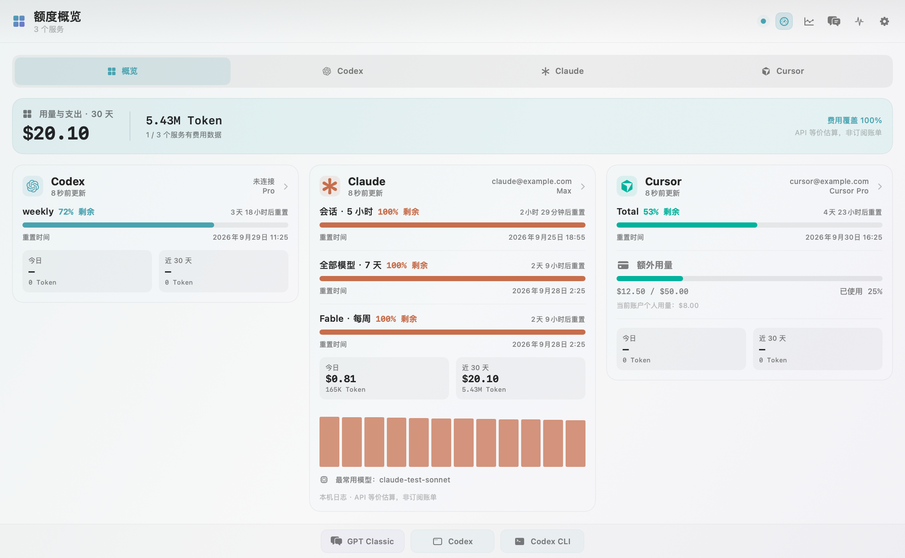
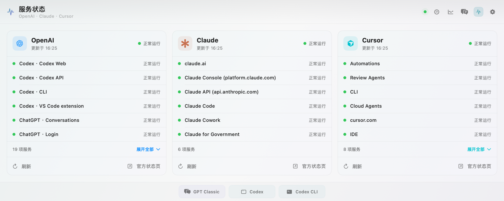
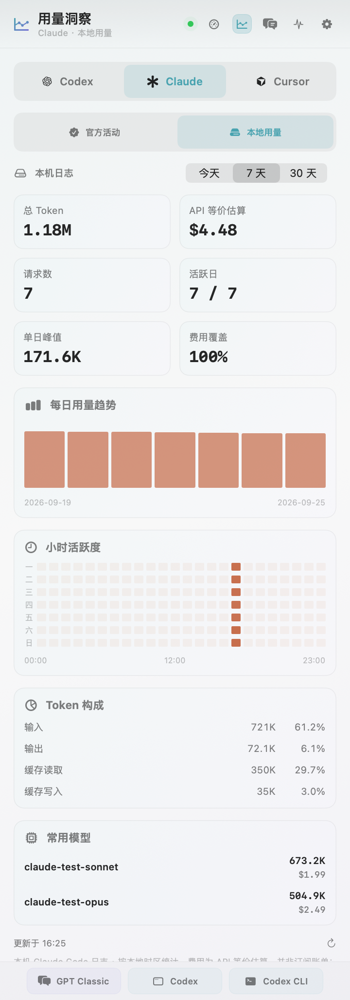
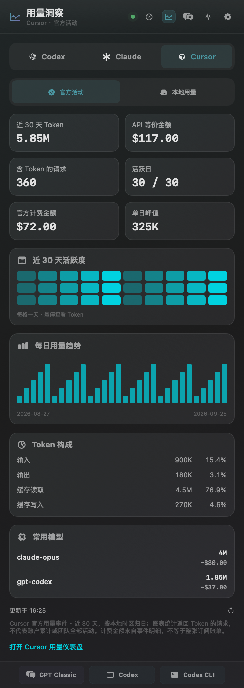
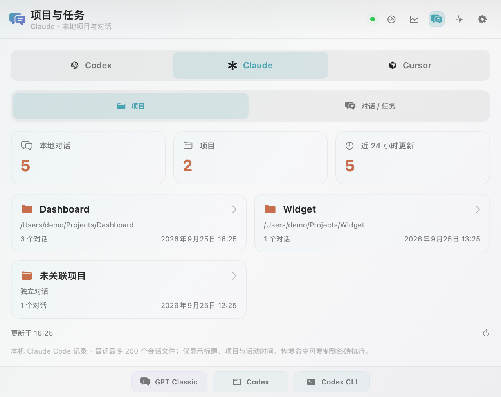

# Codex Usage for DockDoor Pro

An unofficial, feature-rich Codex usage widget for
[DockDoor Pro](https://dockdoor.net/). It brings quota, activity, local Token
analytics, projects/tasks, context health, and multi-provider service status into the
Dock and a native SwiftUI panel. It can also read an existing Cursor.app
session to show Cursor quota and aggregate usage alongside Codex. Claude Code subscription quota is also supported through its existing local sign-in.

> This widget is distributed independently and is not part of the DockDoor Pro
> marketplace. Installation is manual.

## What's new in 2.6.0

The first public release after 2.1.0 adds Claude Code and extends the widget across three providers:

- **Quota:** Claude account/plan, session/weekly/model-specific limits; exact reset timestamps and countdowns; Cursor on-demand usage in quota cards.
- **Dock:** independent provider bars and cards replace rings, with consistent percentage typography in every slot size and orientation.
- **Panel:** wide quota Overview, content-sized pages within the screen, smooth transitions and native DockDoor window placement.
- **Service status:** matching OpenAI / Claude / Cursor cards, six-service previews, expandable lists and always-visible affected/unknown services.
- **Projects & Tasks:** provider selection, local Claude / Cursor projects and conversations, resume-command copying, project opening and saved Cursor context/code-change counts.
- **Insights:** Claude today / 7-day / 30-day local analytics; Cursor official 30-day trends, models, token mix and reported amounts; explicit data-source limits and fetch-error states.

| Provider | Official activity | Local insights |
| --- | --- | --- |
| Codex | Account totals, streaks, trends and activity heatmap | Token/cost, hourly activity, projects, context and task metrics |
| Claude | Personal Pro / Max plans currently lack official analytics | Token/cost estimates, daily/hourly activity, token mix and period-matched models |
| Cursor | 30-day account events, token/model breakdown and reported amounts | Saved conversations, projects and context samples; no invented local token billing |

See [CHANGELOG.md](CHANGELOG.md) for the full release history.



### Connect Claude Code

1. Install Claude Code and run `claude auth login` (or `~/.local/bin/claude auth login` if it is not on PATH).
2. Enable **Claude Code analytics** in widget settings.
3. Set **Dock provider → All providers** to include Claude alongside Codex and Cursor. Existing provider choices are preserved when upgrading.
4. Open **Settings → Claude Code → Authorize sign-in access** if macOS Keychain permission is required. Background refreshes never trigger a Keychain permission prompt.

The widget reads `~/.claude/.credentials.json` or the `Claude Code-credentials` Keychain item and sends the access token only to the Anthropic OAuth `/api/oauth/usage` and `/api/oauth/profile` endpoints. Credentials are never stored in widget preferences or refreshed/written by this widget. Expired sign-in must be renewed by Claude Code. Custom `CLAUDE_CONFIG_DIR` / `CLAUDE_SECURESTORAGE_CONFIG_DIR` file profiles are supported when inherited by DockDoor; a custom profile never falls back to the default account's Keychain item. Claude snapshots are held in memory only.

This is subscription quota, not API credits. API-key-only accounts, organizational restrictions, or upstream response changes may leave quota unavailable. Login success and live quota availability must be verified on the target machine.

## Screenshots

These previews use anonymous fixture data, not a real account or conversation.

### Unified service status



### Usage insights

| Claude local usage | Cursor official activity |
| --- | --- |
|  |  |

### Local projects and conversations



The Codex views retain project usage, context health and task efficiency. Claude and Cursor show the metadata available from their local histories. Claude sessions offer a copyable resume command; Cursor offers project opening and a copyable conversation ID.

## Requirements

- macOS 14 or later.
- DockDoor Pro with local widget support. This release was tested with DockDoor
  Pro 1.5.0.
- A current [Codex CLI](https://learn.chatgpt.com/docs/codex/cli) installation.
- For quota and account activity, sign in with Codex first.
- Cursor data is optional. To enable it, install Cursor.app and sign in there;
  the widget reads that existing local session without modifying it.
- Claude data is optional. Install Claude Code and sign in to a supported subscription.
- Xcode Command Line Tools are needed only when building from source.

## Install a release

1. Download `CodexUsageMonitor.bundle.zip` from the
   [latest release](https://github.com/skykeyjoker/codex-usage-dockdoor-widget/releases/latest).
2. Quit DockDoor Pro.
3. Run the installer from this repository:

   ```bash
   ./scripts/install.sh ~/Downloads/CodexUsageMonitor.bundle.zip
   ```

   Or extract the archive and copy `CodexUsageMonitor.bundle` to:

   ```text
   ~/Library/Application Support/DockDoorPro/Widgets/
   ```

4. Reopen DockDoor Pro.
5. Confirm **Codex Usage** appears under **Widgets → Installed**, then add it to
   a stack and choose a one-, two-, or three-slot size.

The installer preserves an existing bundle as a timestamped backup next to the
new installation. If macOS quarantines a manually downloaded bundle and
DockDoor Pro cannot load it, inspect the download and then remove quarantine
from that specific bundle only:

```bash
xattr -dr com.apple.quarantine \
  "$HOME/Library/Application Support/DockDoorPro/Widgets/CodexUsageMonitor.bundle"
```

## Build from source

The DockDoor Pro SDK and build infrastructure are intentionally not vendored.
The build helper uses a temporary clone of the official widget repository,
copies this widget into it, and invokes the upstream universal-bundle builder.

```bash
git clone https://github.com/skykeyjoker/codex-usage-dockdoor-widget.git
cd codex-usage-dockdoor-widget
./scripts/build.sh
./scripts/install.sh dist/CodexUsageMonitor.bundle.zip
```

Output:

```text
dist/CodexUsageMonitor.bundle.zip
```

To build against a fork or a pinned local Git remote, set:

```bash
DOCKDOOR_WIDGETS_REPOSITORY=/path/to/dockdoorpro-widgets.git ./scripts/build.sh
```

The script rejects a bundle unless its executable contains both `arm64` and
`x86_64` slices.

## Claude local history

Native assistant usage metadata is read from `$CLAUDE_CONFIG_DIR/projects` when configured; otherwise from `~/.claude/projects`, `~/.config/claude/projects` and the Claude Desktop `claude-code-sessions` / `local-agent-mode-sessions` directories under Application Support. Available `.jsonl` records are deduplicated by request/message identity, or session/message identity when request IDs are absent. Only aggregate usage metadata is retained in memory; prompts/tool outputs are not retained, cached or uploaded. Unchanged files reuse parsed metadata; changed files are reread, and deleted files leave the totals.

Statistics cover this machine's last 30 local calendar days and can include more than one account. They are not an account-wide subscription bill. Pricing uses the existing cached models.dev catalog and only its Anthropic provider; unknown rates, unsupported fast modes are unpriced rather than guessed. Cost coverage and partial estimates identify these limits. No transcript files means unavailable local history, not measured zero usage.

## Validation

```bash
./scripts/test-claude.sh
./scripts/test-claude.sh --render /absolute/path/to/previews
# Optional: read live quota using local credentials (never prints tokens).
./scripts/test-claude.sh --live
# Optional: verify live local/provider history and official endpoints.
./scripts/test-claude.sh --live-insights
./scripts/test-claude.sh --live-provider-pages
```

Set `DOCKDOOR_WIDGETS_SOURCE=/path/to/dockdoorpro-widgets` to use an existing SDK checkout. Otherwise the test script obtains the upstream build SDK in a temporary directory. Tests cover quota parsing, credential/expiry handling, scoped limits, rate-limit backoff, token deduplication and pricing, model/hour/period consistency, current/legacy Cursor indices, official-event error states, status previews, settings compatibility and host-owned window geometry. Preview data is synthetic.

## Configuration

| Setting | Choices | Effect |
| --- | --- | --- |
| Cursor analytics | On / Off | Enables Cursor.app authentication and Cursor network refreshes. Off hides Cursor and stops Cursor requests; Claude can remain enabled. |
| Dock provider | Codex / Claude / Cursor / Codex + Cursor / All providers | Shows enabled providers as independent quota bars or cards. |
| Claude Code analytics | On / Off | Enables Claude quota, local usage, project metadata and service status. |
| Primary quota | Weekly / Session | Selects the quota shown in the Dock. |
| Value | Remaining / Used | Selects percentage semantics. |
| Theme | System Accent, Codex Teal, Ocean, Violet, Blue Magenta, Mint, Sunset | Applies adaptive light/dark highlights. |
| Show service status | On / Off | Adds the current OpenAI health indicator to the Dock. |
| Token format | Automatic / Exact / Millions (2 decimals) / Millions (1 decimal) / Billions (2 decimals) | Controls Token-number rounding throughout the Panel. |
| Display currency | USD / CNY / EUR / GBP / JPY / HKD / KRW / CAD / AUD / SGD / CHF | Converts USD-denominated estimates throughout the Panel using the latest cached ECB working-day reference rates. |
| Codex hourly activity range | This week / Last year | Switches the Codex heatmap data and range label; Claude uses the selected local-insights period. |
| Panel content preset | Simplified / Full / Custom | Applies a compact default, shows every card, or preserves individual choices. |
| Page visibility | Quota overview / Usage insights / Projects & tasks / Service status | Hides entire content pages while keeping at least one page available. |
| Card visibility and order | Per Panel section | Chooses and reorders cards while keeping at least one card in each visible section. |
| Bottom quick-launch bar | On / Off | Shows or hides the persistent launcher at the bottom of the Panel. |
| Quick-launch buttons | GPT Classic / Codex Desktop / Codex CLI | Independently selects which launch targets appear. |
| CLI terminal | Automatic / Terminal / Ghostty / iTerm2 / Warp | Selects the terminal used by the CLI launcher and CLI conversation resume. |
| Quota usage source | Automatic / OAuth API / CLI RPC | Controls session and weekly quota fetching only. |
| Refresh interval | 1 / 5 / 15 / 30 minutes | Controls scheduled refresh. |
| GitHub release checks | On / Off | Checks the public Releases API at most every 12 hours and shows update availability in Settings. |

**Automatic** tries the OAuth quota endpoint first and falls back to the local
CLI only for missing/expired local sign-in cases. Local Token/cost analytics,
official activity, pricing, and status refresh independently of this choice.

The standalone CLI shortcut opens the selected terminal and types `codex`
without executing it. Clicking a conversation identified as a Codex CLI
session opens the selected terminal and runs `codex resume` for that session.
GPT Classic opens the installed legacy ChatGPT desktop app when available and
falls back to the ChatGPT website otherwise.

## Data sources and network access

The widget has no telemetry service and no developer-operated backend. It does,
however, use the following local and remote sources to provide its features.

| Source | Data used | Purpose | Network behavior |
| --- | --- | --- | --- |
| `~/Library/Application Support/Cursor/User/globalStorage/state.vscdb` | Existing Cursor.app access Token | Establishes the same Cursor web session already used by Cursor.app | Opened read-only through SQLite. The Token is held only for the request and is never copied into widget preferences or caches. |
| `https://cursor.com/api/usage-summary`, `/api/auth/me`, `/api/usage`, and Cursor dashboard usage endpoints | Cursor plan, quota windows, on-demand usage, aggregate Token counts, models, and cost fields | Cursor Panel and optional Cursor Dock presentation | Authenticated directly with the existing Cursor.app session. No prompt, source code, or tool output is requested or sent by the widget. Cursor endpoints are not public versioned APIs and may change without notice. |
| `~/.codex/auth.json` (or `$CODEX_HOME/auth.json`) | Existing access/identity Token and account ID | OAuth quota, reset credits, account email/plan | Read-only. The widget never refreshes or writes Codex credentials; Automatic mode falls back to CLI RPC when OAuth is stale. |
| Local `codex app-server` in read-only/untrusted mode | `account/read`, `account/rateLimits/read`, `account/usage/read` aggregate responses | CLI quota source, credits, official activity | The widget communicates with a local Codex process over stdin/stdout. |
| `~/.codex/sessions` and `~/.codex/archived_sessions` | Token counts, model/service tier, timestamps, turn/session IDs, project path, context and timing metadata | Local usage, projects, task efficiency, context health | Read locally; this widget does not upload these logs. |
| `~/.codex/history.jsonl` and session prefixes | First local user message/title, session ID, project path, modified time | Recent conversation list and Codex deep links | Read locally into memory; titles are not persisted by this widget or uploaded. |
| `~/.codex/logs_2.sqlite` | Short-lived websocket trace metadata | More accurate Fast/Priority attribution | Read locally with `/usr/bin/sqlite3 -readonly`. |
| `https://chatgpt.com/backend-api/wham/usage` | Quota windows, plan, credits, extra limits | OAuth quota source | Bearer-authenticated direct request to OpenAI. |
| `https://chatgpt.com/backend-api/wham/rate-limit-reset-credits` | Reset-credit count and expiry | Reset-credit card | Bearer-authenticated direct request to OpenAI. |
| `https://chatgpt.com/backend-api/accounts/{account}/spend-controls/current-user/monthly-usage` | Administrator monthly usage and limit | Business/Team/EDU/Enterprise monthly quota fallback | Bearer-authenticated direct request to OpenAI for eligible workspace plans. |
| `https://models.dev/api.json` | Public model price catalog | API-equivalent cost estimates | Anonymous request; bundled prices are the fallback. |
| `https://www.ecb.europa.eu/stats/eurofxref/eurofxref-daily.xml` | Official daily EUR reference rates | Converts USD-denominated estimates to the selected display currency | Anonymous request only when a non-USD currency is selected. Checked at most every 12 hours and cached locally; no quota or usage data is sent. |
| Claude Code credentials file / Keychain | Existing subscription access token | Claude quota/profile | Read-only; only sent directly to Anthropic OAuth usage/profile endpoints. No background Keychain prompts or token refresh writes. |
| Claude Code native session logs | Usage/model/cache metadata, title or first-message excerpt, project path and timestamps | Local analytics and project/conversation lists | Read locally; usage metadata and display titles stay in memory. No transcript upload. |
| Cursor `composerHeaders` and workspace indices | Conversation titles, project paths, last-updated time, saved context/code-change metadata | Local projects/conversations/insights | SQLite is opened read-only; no conversation content is uploaded. |
| `https://status.claude.com/api/v2/summary.json` and `https://status.cursor.com/api/v2/summary.json` | Public component status and active incidents | Claude/Cursor service cards | Anonymous requests. |
| `https://status.openai.com` | Overall and component status | ChatGPT/Codex service-status page and Dock indicator | Anonymous request. |
| GitHub Releases API and `/releases/latest` redirect | Latest stable tag, name, URL, and publish time when available | Optional release-update reminder in Settings | Anonymous request, enabled by default and throttled to at most once every 12 hours. The redirect is the API rate-limit fallback; no local widget data is sent. |

The ChatGPT `backend-api/wham` endpoints are not a public, versioned API and may
change without notice. The CLI RPC option is available as an alternative quota
source.

## Privacy and local persistence

- No analytics, crash reporting, telemetry, or custom server is included.
- OAuth access and refresh Tokens are never copied into widget caches.
- Cursor.app access Tokens are read only when refreshing Cursor data and are
  never copied into widget caches or DockDoor Pro preferences.
- Local usage aggregation parses only metadata needed for counts, pricing,
  project/task metrics, and context health. It does not retain prompt or tool
  output bodies.
- The recent-conversation feature reads a local first-user-message/title for
  display. That title remains in memory for the current process and is not
  written to a widget cache.
- Quick launch uses only local application discovery and local session IDs.
  It does not send launch or resume activity to a developer-operated service.
- Release checks send only a standard anonymous request to GitHub's public
  Releases API and never include quota, conversation, project, or path data.
- DockDoor Pro `UserDefaults` stores widget settings and aggregate snapshots.
  Those snapshots can include account email/plan, quota, status, project paths,
  session IDs, Token totals, costs, and health metrics, but not OAuth Tokens.
- Incremental local-log state is cached at:

  ```text
  ~/Library/Caches/DockDoorPro/CodexUsageMonitor/local-token-cache.sqlite
  ```

  It uses SQLite WAL with per-file incremental offsets and transactional
  updates. It contains file/session/project metadata and aggregate Token
  events, not prompt text or credentials. A legacy JSON cache is read once for
  migration but is no longer rewritten.
- The models.dev catalog is cached at:

  ```text
  ~/Library/Caches/DockDoorPro/CodexUsageMonitor/model-pricing/models-dev-v1.json
  ```

To clear file caches:

```bash
rm -rf "$HOME/Library/Caches/DockDoorPro/CodexUsageMonitor"
```

To remove the widget's DockDoor Pro preferences and aggregate snapshots, quit
DockDoor Pro and delete the `widget.codex-usage-monitor.*` keys from the
`com.ejbills.DockDoorPro` defaults domain. Removing the entire domain also
removes unrelated DockDoor Pro settings, so it is not recommended.

## Accuracy notes

- Displayed cost is an **API-equivalent estimate, not a subscription bill**.
- Currency conversion is display-only. Source costs remain stored in USD; the
  Panel converts them with the latest successfully cached ECB reference rates.
  ECB normally publishes new rates on working days, so weekends and TARGET
  closing days retain the latest published business-day rate.
- Pricing applies model-specific input, output, cache read/write,
  long-context, and Fast/Priority rules when the required metadata is present.
- `models.dev` is preferred; a built-in OpenAI price table is the fallback.
- Partial cost estimates are prefixed with `~` and report priced Token/request
  coverage instead of presenting incomplete totals as complete bills.
- Codex local history uses a pinned Gregorian/IANA-time-zone scan, retains up to 365
  days, and exposes 7-day, 30-day, and All-time summaries plus hourly activity.
- Local counts depend on the fields present in the installed Codex version and
  available session history. Archived or deleted logs cannot be reconstructed.
- Fast/Priority trace data is short-lived. Explicit trace evidence takes
  precedence; older turns fall back to the service tier stored in session logs.

## Troubleshooting

### The widget is installed but does not appear when editing a stack

- Confirm the bundle is exactly at
  `~/Library/Application Support/DockDoorPro/Widgets/CodexUsageMonitor.bundle`.
- Quit and reopen DockDoor Pro after replacing the bundle.
- Confirm the bundle archive was extracted rather than copied as a ZIP.
- If Gatekeeper blocked the bundle, use the targeted `xattr` command from the
  installation section after verifying the release checksum.

### Quota is unavailable

- Run `codex` in Terminal and sign in.
- In Settings, try **Quota usage source → CLI (RPC)**.
- Update Codex CLI if `account/rateLimits/read` is unavailable.

### Cursor quota is unavailable

- Open Cursor.app and confirm that it is signed in.
- In the Panel, switch to **Cursor** and choose **Refresh Cursor**.
- If Cursor recently changed accounts, restart Cursor.app so its local session
  database is current. The widget does not launch a separate sign-in flow.

### Official activity is unavailable

The installed Codex app-server must support `account/usage/read`. Local usage
insights remain available independently.

### A CLI shortcut opens the terminal but does not type anything

- Confirm the preferred terminal is installed, or select **Terminal**.
- Allow DockDoor Pro to control keyboard input in macOS Privacy & Security if
  macOS asks for permission.
- The standalone shortcut intentionally types `codex` without pressing Return.
  A CLI conversation row executes `codex resume` because the row itself is an
  explicit resume action.

### Local usage or cost looks incomplete

- Check that recent `.jsonl` files exist under `$CODEX_HOME` or `~/.codex`.
- Allow one refresh for the incremental cache to catch up.
- A zero cache-write value can be normal when Codex does not emit a separate
  cache-write counter.
- Cost is omitted for a model that is absent from both the live and built-in
  price catalogs.

## License and acknowledgements

The original widget code in this repository is released under the
[MIT License](LICENSE). See [third-party notices](THIRD_PARTY_NOTICES.md) for
CodexBar attribution and DockDoor Pro SDK terms.

Thanks to the DockDoor Pro project for the widget platform and to
[CodexBar](https://github.com/steipete/CodexBar) for its MIT-licensed quota and
cost-usage compatibility work.

Claude local analytics cover 30 local calendar days; the project browser reads up to 200 recent session files. Cursor local project/conversation metadata reads up to 500 headers. Cursor official charts cover token-bearing account events over 30 days; an unavailable or truncated fetch is labeled explicitly.

[Claude personal Pro / Max analytics availability](https://support.claude.com/en/articles/12157520-claude-code-usage-analytics) and [Cursor analytics documentation](https://cursor.com/docs/account/teams/analytics) describe the upstream data limits. Cursor internal storage/dashboard formats and Claude OAuth quota fields can change independently of this widget.
